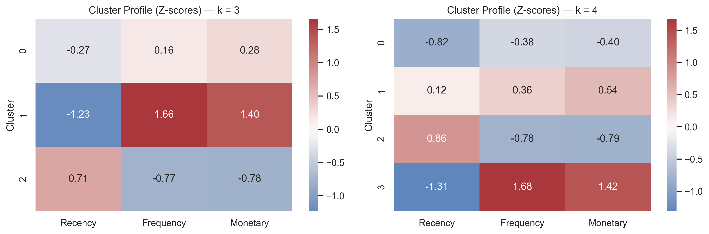
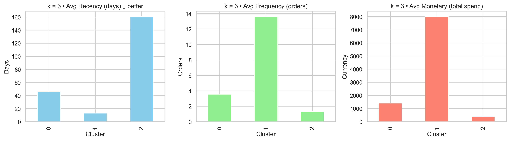
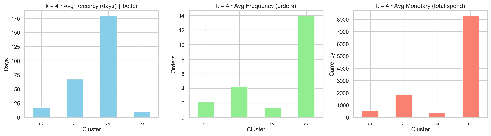
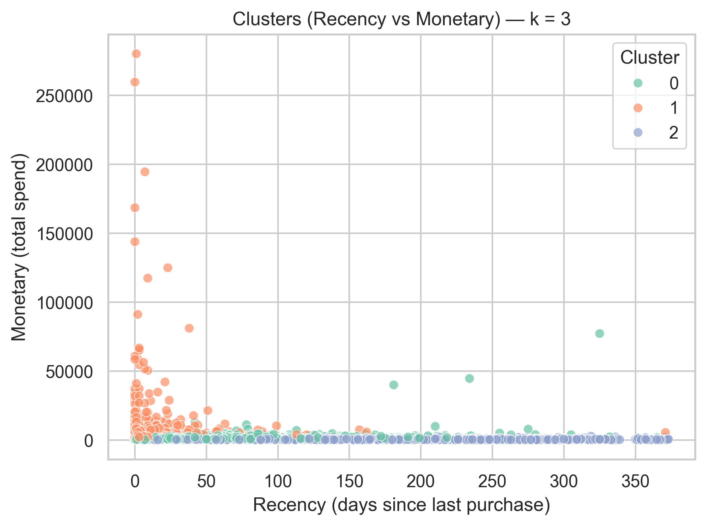
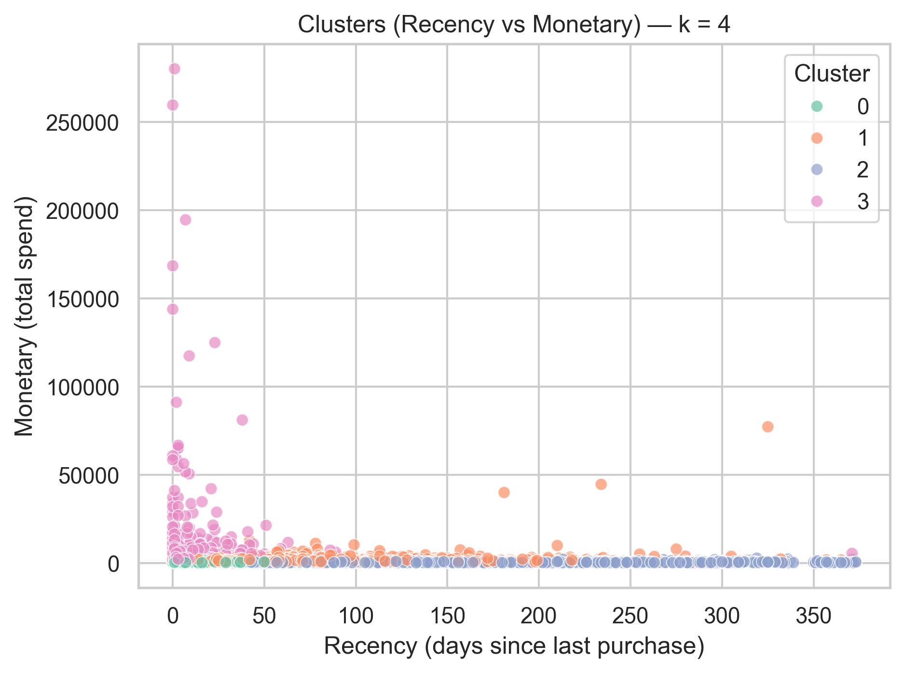

# 🛒 Customer Segmentation with RFM and KMeans

## 📌 Project Overview
This project applies RFM (Recency, Frequency, Monetary) analysis and KMeans clustering to segment customers of an online retail store. The goal is to help the business design targeted marketing strategies and improve customer retention by identifying distinct customer personas.

## 📊 Dataset
- **Source:** [Kaggle E-commerce Data](https://www.kaggle.com/datasets/carrie1/ecommerce-data)
- **Period:** Dec 2010 – Dec 2011
- **Size:** ~540,000 rows, 8 variables
- **Key Fields:**
  - `InvoiceNo` - transaction number
  - `CustomerID` - unique customer ID
  - `InvoiceDate` - date of purchase
  - `Quantity` - number of items purchased
  - `UnitPrice` - price per item
  - `Country` - customer’s country
⚠️ Note: The dataset is not included in this repository due to size limitations.  
Please download it from Kaggle and place it in the `data/` folder.

## 🛠️ Methodology
1. **Data Cleaning**
    - Removed missing `CustomerID` values
    - Excluded cancelled orders (`InvoiceNo` starting with “C”)
    - Kept only positive `Quantity` and `UnitPrice`
    - Created `TotalPrice = Quantity × UnitPrice`
2. **Feature Engineering (RFM)**
    - **Recency:** days since last purchase
    - **Frequency:** number of unique invoices
    - **Monetary:** total spend
3. **Preprocesing**
    - Applied log-transform to reduce skewness
    - Standardized features using `StandardScaler`
4. **Clustering**
    - Used **Elbow Method** and **Silhouette** Score to test cluster counts
    - Fit KMeans clustering for **k = 3 and k = 4**
    - Compared profiles to choose the most actionable segmentation

## 📈 Results & Insights
- **Cluster Profiles (k = 3)**
    | Cluster  | Persona | Characteristic  | Suggested Action |
    | ------------- | ------------- | ------------- | ------------- |
    | 0  | Regular Shoppers  | Recency ~46 days, 3–4 orders, ~$1.4k spend  | Upsell with bundles or seasonal campaigns  |
    | 1  | VIP / Loyal High-Value  | Very recent (~13 days), 14 orders, ~$8k spend  | Reward with loyalty perks, exclusive offers  |
    | 2  | At-Risk / Dormant  | Long inactive (~161 days), ~1 order, ~$350 spend  | Win-back discounts, targeted reactivation  |
- **Cluster Profiles (k = 4)**
    | Cluster  | Persona | Characteristic  | Suggested Action |
    | ------------- | ------------- | ------------- | ------------- |
    | 0  | New / Low-Spend Recent  | Recent (~17 days), 2 orders, ~$545 spend  | Onboarding emails, encourage repeat purchase  |
    | 1  | Established Regulars  | Recency ~68 days, 4 orders, ~$1.8k spend  | Maintain engagement, cross-sell or upsell  |
    | 2  | At-Risk / Dormant  | Long inactive (~179 days), ~1 order, ~$350 spend  | Reactivation campaigns, discounts  |
    | 3  | VIP / Loyal High-Value  | Very recent (~10 days), 14 orders, ~$8.3k spend  | Exclusive rewards, maintain strong loyalty  |

## 🔹 Visualizations
### Heatmaps of z-scores across clusters


### Bar plots of average Recency, Frequency, Monetary



### Scatter plots (Recency vs Monetary, colored by cluster)



## 💡 Business Implications
- **VIPs →** loyalty perks, exclusive rewards
- **Regular Shoppers →** upsell and seasonal offers
- **At-Risk Customers →** win-back campaigns
- **New Customers →** onboarding and engagement

## ⚖️ Limitations & Next Steps
- KMeans assumes spherical clusters; alternative methods (DBSCAN, hierarchical) could reveal different patterns
- RFM ignores product categories; future work could add **product-level or seasonality features**
- Deploying a **Streamlit app** or **Tableau dashboard** would make this segmentation interactive for business users

## 🛠️ Tech Stack
- **Python:** pandas, numpy, scikit-learn, seaborn, matplotlib
- **Clustering:** KMeans
- **Visualization:** seaborn, matplotlib

## ⚙️ Installation
Clone this repository and install dependencies:

```bash
git clone https://github.com/aituar17/Customer_Segmentation.git
cd Customer_Segmentation
pip install -r requirements.txt
```
## 📂 Project Structure
```plaintext
Customer_Segmentation/
├── data/ # Dataset folder (not uploaded to GitHub due to size; see data/README.md)
├── images/ # Saved plots for README (heatmaps, bar plots, scatter plots)
│ └── zscore_heatmaps.png
│ └── barplots_k3.png
│ └── barplots_k4.png
│ └── scatter_k3.png
│ └── scatter_k4.png
├── notebooks/ # Jupyter notebook with full analysis
│ └── Customer_Segmentation.ipynb
├── .gitignore # Ignore large files (e.g., dataset)
├── README.md # Project documentation
└── requirements.txt # Dependencies for reproducibility
```
